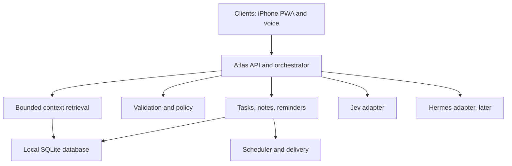
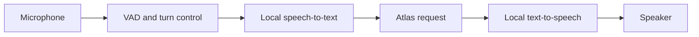

# Atlas

Atlas is a local-first personal context and task system intended to reduce mental load while keeping the user in control.

Its first useful loop is:

> **capture → understand → remember → surface**

Atlas owns context, canonical records, execution, scheduling, policy, and audit history. External reasoning services may help interpret a request, but they produce proposals that Atlas validates before anything is stored or executed.

## Project status

Atlas now has a runnable Go foundation with SQLite-backed task creation, details, optional deadlines, editing, completion/reopening, deletion, and transactional activity history, with a responsive browser interface. The remaining sections describe the intended product and architecture; fixed-time and daily/weekly recurring reminders now deliver to a durable webpage inbox. Persistent plain-text notes now link explicitly to tasks and reminders. Search finds text across tasks, reminders, and notes with type/status filters and direct record links. Capture interprets common English sentences into reviewed tasks, reminders, and notes, with explicit fields for correction and atomic saving. Ambiguous or unsupported wording asks for clarification. External notifications, reasoning adapters, and PWA installation/offline support are not implemented yet.

## Run locally

Requires Go 1.27 or newer.

```sh
make run
# Open http://127.0.0.1:8080 in your browser.
# Or use the API in another terminal:
curl -X POST http://127.0.0.1:8080/api/v1/tasks \
  -H 'Content-Type: application/json' -d '{"title":"Call Mom"}'
curl http://127.0.0.1:8080/api/v1/tasks
curl http://127.0.0.1:8080/api/v1/activity
make check
```

The default database is `data/atlas.db`. Configure paths and listen address with `go run ./cmd/atlas -db /path/to/atlas.db -addr 127.0.0.1:8080`. Records survive service restarts. See [API.md](API.md) for structured responses, creation retries, schemas, and the webpage API lab tab. [DEVELOPMENT.md](DEVELOPMENT.md) covers current limits and the feature → development → main branching workflow.

Before wiring in Jev, Hermes, voice runtimes, notification providers, or other integrations, verify their actual APIs, licensing, hosting requirements, and tool semantics.

## Product intention

Atlas should make it easy to turn a thought into a reliable, inspectable action without surrendering control to an autonomous system.

The system is designed around a few principles:

- Local-first storage and operation
- Explicit user control over consequential actions
- Deterministic validation around model-generated proposals
- Small, bounded context supplied to external reasoning services
- Durable reminders that survive restarts and service failures
- Transparent activity history explaining what happened and why
- Incremental capabilities driven by real workflows rather than speculative framework layers

## MVP capabilities

The minimum useful Atlas should support:

- Capture a typed request from one user
- Create, view, edit, complete, and delete tasks
- Create and manage fixed-time reminders
- Store short notes and explicit links to tasks or reminders
- Interpret natural-language requests through Jev when appropriate
- Validate proposed operations and ask focused clarification questions
- Schedule reminders with durable delivery state
- Snooze and complete reminders
- Show an activity log explaining stored actions and reminder delivery
- Run locally without an account or sync requirement
- Continue deterministic capture and reminders when Jev is unavailable

The first client target is an iPhone. The initial client should be a responsive Progressive Web App (PWA), usable from iPhone Safari and installable on the Home Screen without requiring a paid Apple Developer account. A native SwiftUI shell can be added later if PWA limitations become blocking.

Voice is an input and output interface for the same request loop. Text should work end to end before voice is introduced.

## Product boundaries

### In scope for the MVP

- Tasks, notes, reminders, explicit relations, and activity history
- Fixed-time scheduling
- A local SQLite database with migrations
- A Go-based Atlas core and API
- One iPhone-oriented PWA client
- Push-to-talk voice after the text workflow is proven
- A bounded Jev adapter for interpretation

### Later, behind interfaces

- Relative-to-event reminders
- Calendar adapters
- Browser capture
- Document ingestion
- Semantic search and richer context retrieval
- Graph traversal
- Research workflows
- Multi-device sync
- Background voice and wake-word support
- Proactive suggestions
- External actions
- Hermes-based bounded agent workflows

### Explicitly out of the MVP

- Email automation
- Shopping workflows
- Autonomous external writes
- A general-purpose research agent
- Custom speech-to-text or text-to-speech training
- An always-listening microphone
- A broad personal knowledge graph

## System architecture



### Atlas core

The Atlas core is planned in Go. It owns:

- Canonical records and transactions
- Request idempotency
- Permissions and allowlisted operations
- Policy enforcement
- Scheduling and delivery state
- Context access boundaries
- Audit and decision history

The core treats model output as an untrusted proposal. Jev and Hermes must never write directly to storage or invoke external tools outside Atlas policy boundaries.

### Jev adapter

Jev is the chosen decision layer for interpreting user input. Intent, context selection, and semantic clarification belong in Jev rather than an expanding set of programmatic English rules. The current local interpreter is a temporary compatibility bridge. Jev may:

- Interpret ambiguous language
- Request bounded additional context
- Propose structured operations
- Draft short explanations

Jev does not own canonical state. Atlas resolves IDs, validates dates and capabilities, checks duplicates and permissions, and commits approved operations.

### Hermes adapter

Hermes is an optional future adapter for explicitly scoped, multi-step work. It is not a second source of truth and should remain inactive until a concrete workflow justifies it. Hermes output follows the same validation and policy boundary as Jev.

### Clients

The initial client is an iPhone-first PWA. The client communicates with the Atlas API and should not contain canonical business logic.

Future clients may include:

- A native iPhone shell if needed
- A desktop hub
- A second mobile or desktop client
- A browser extension when web capture becomes useful

## Interfaces

### User interface

The first user-facing interface is the iPhone PWA. It should provide:

- Text capture
- Task, reminder, and note views
- Editing and completion actions
- Reminder snooze controls
- Activity and decision history
- Settings for privacy, external reasoning, and timezone behavior
- Offline drafts or queued requests where practical

### HTTP API

The initial API surface is expected to include:

- `POST /requests` — submit text input and receive a result or clarification
- `GET/POST/PATCH /tasks` — manage tasks
- `GET/POST/PATCH /reminders` — manage reminders
- `GET/POST/PATCH /notes` — manage notes
- `POST /clarifications/{id}/answer` — resume a paused request
- `POST /reminders/{id}/snooze` — create a new delivery time
- `POST /reminders/{id}/complete` — complete a reminder and cancel future delivery
- `GET /activity` — inspect action and delivery explanations

Wire contracts should be versioned. Internal domain methods should remain independent of HTTP.

### Reasoning and context interfaces

Jev receives a bounded `request_context` interface rather than database credentials. Context queries should be typed, limited, and explicit, such as:

- `upcoming_events`
- `matching_tasks`
- `matching_reminders`
- `search_notes`

Context results should contain compact facts, stable IDs, and provenance. Atlas should enforce result limits, token budgets, sensitive-field rules, and a maximum number of retrieval rounds.

### Voice interfaces

Voice is an adapter around the same text request contract:



Use provider interfaces such as:

- `Transcriber`: audio to text
- `Synthesizer`: text to audio

Begin with push-to-talk. Keep the transcript visible for correction before any consequential action. Spoken acknowledgements must describe committed state, never merely a model proposal.

## Core data model

Start with SQLite and durable migrations. Use stable IDs, UTC instants for execution, IANA time zones for user-facing recurrence and display, creation/update timestamps, and a schema version.

| Record | Essential fields |
| --- | --- |
| `task` | id, title, details, status, due_at?, source, created_at, updated_at |
| `note` | id, body, created_at, updated_at |
| `reminder` | id, title, status, trigger_kind, scheduled_at?, timezone, task_id?, source_text, created_at, updated_at |
| `relation` | id, from_type/id, relation_type, to_type/id |
| `delivery` | id, reminder_id, scheduled_at, state, attempted_at?, delivered_at?, error?, dedupe_key |
| `decision_log` | id, request_id, input_source, proposal_summary, validation_result, context_ids, outcome, timestamp |

Keep the original utterance as `source_text` only under a clear retention policy. Avoid storing raw audio by default. Do not infer a complete people/projects/documents ontology until real workflows require typed entities.

## Request orchestration

Every request should follow a controlled sequence:

1. Accept an input envelope containing request ID, source, text, user timezone, timestamp, and client capabilities.
2. Retrieve a small initial context using structured queries.
3. Ask Jev for a versioned structured proposal from natural-language user input. Explicit structured commands can go directly to deterministic validation. The existing rule interpreter remains a temporary bridge until the Jev adapter is connected.
4. Validate the proposal against a schema and allowlisted operations.
5. Resolve references to canonical IDs and check dates, duplicates, permissions, and available context.
6. Ask one focused clarification question when required information is missing or references are ambiguous.
7. Apply an approved operation transactionally and record the decision.
8. Schedule or reschedule delivery from committed state.
9. Return the canonical result and a short user-facing explanation.

The MVP may support only `at_time` reminder triggers. Unsupported relative triggers should produce a clarification or manual scheduling choice. Atlas must not silently invent an offset or date interpretation.

## Reminder lifecycle

Reminder reliability is a core product feature:

- Persist reminder state and its next delivery atomically, or reconcile them from committed state.
- Have a worker claim due deliveries using a dedupe key.
- Re-read current reminder state before delivery.
- Record attempted, delivered, failed, and acknowledged states separately.
- Retry transient errors with bounded backoff.
- Recover safely after restart without duplicate notifications.
- Make snooze create a new delivery.
- Make completion cancel future deliveries.
- Recompute event-relative reminders when their referenced event changes.
- Test timezone and daylight-saving transitions explicitly.
- Require a configured local delivery time for date-only reminders.

## Privacy, permissions, and reliability

- Keep canonical records local and usable without an account or sync service.
- Minimize context sent to Jev.
- Redact secrets and sensitive document content before external calls.
- Provide per-feature opt-in for external model use.
- Make the payload supplied to Jev inspectable where practical.
- Scope tools per operation with explicit read and write allowlists.
- Use an explain → confirm → act flow for external actions.
- Never place API keys in client source or logs.
- Make requests idempotent using request IDs.
- Keep migrations, backups, and export in view before sync is introduced.
- Make model failures and offline state visible, with a usable manual path.

## Implementation order

The recommended build sequence is:

1. Repository, contracts, configuration, and local run command
2. SQLite storage for tasks, notes, reminders, relations, and decision logs
3. Deterministic fixed-time reminder engine
4. Text interface proving capture through notification
5. Request orchestration, validation, policy, and clarification flow
6. Jev adapter with structured proposals and payload minimization
7. Bounded context resolver and note search
8. Push-to-talk voice input with local speech-to-text
9. Local text-to-speech for committed responses
10. Additional client or sync decisions based on real usage
11. Calendar, browser, research, Hermes, and proactive capabilities one use case at a time

The most important milestone is the first vertical slice:

> “Remind me to call Mom tomorrow at 6 PM.”

Atlas should resolve the local date and time zone, display the exact scheduled time, commit the reminder, survive a service restart, send one notification, support snooze or completion, and show the activity explanation. This must work before calendar integration, semantic search, or Hermes.

## Future enhancements

Future capabilities should be added behind interfaces and only when a real workflow requires them:

- Event-relative reminders with explicit offsets
- Calendar and scheduling adapters
- Browser and share-sheet capture
- Document ingestion with sensitive-content controls
- Hybrid structured and semantic search
- Richer context graphs
- Multi-device sync and conflict resolution
- Background voice and wake-word flows
- Proactive suggestions with clear user controls
- Research and bounded Hermes workflows
- Carefully scoped external actions

These features should extend the core contracts rather than bypassing validation, policy, audit history, or user confirmation.

## Development principles

- Build small, reviewable vertical slices.
- Prefer deterministic behavior for dates, IDs, permissions, and scheduling.
- Treat model output as input to validation, never as authority.
- Keep the user-visible explanation tied to committed state.
- Avoid empty abstractions for future capabilities.
- Verify behavior with restart, offline, ambiguity, duplicate-request, invalid-proposal, and timezone tests.
- Keep the iPhone PWA thin so the Atlas API remains the durable product boundary.

## Manual task test

1. Run `make run` and open `http://127.0.0.1:8080`.
2. Add a task and refresh the page. It should remain.
3. Edit its title, complete it, switch to Completed, and reopen it.
4. Stop the server with Ctrl+C and run `make run` again. The task and its state should remain.
5. Delete a task and confirm the prompt. It should disappear, with an entry in Activity history.

Tasks are stored in `data/atlas.db`, independent of browser storage. Deletion is permanent; activity history remains. This release is for local use on this computer.

### Test details and deadlines

Expand **Details and deadline (optional)** when adding a task, or use **Edit** on an existing task. Set a description and explicit date/time, save, and refresh. Confirm the deadline displays in the indicated browser timezone. A past deadline on an open task shows **Overdue** and appears in the Overdue filter; completing it removes it from that filter. Edit and use **Clear deadline**, then Save, to remove the deadline. Empty details clear the description. Restart Atlas to verify both fields persist.

Deadlines do not trigger notifications. Standalone reminder delivery, snoozing, and daily/weekly recurrence are available below.

### Test fixed-time reminders

1. In the **Reminders** section, enter a title and click **Test in 5 seconds**.
2. Watch it move from Upcoming reminders into the Reminder inbox automatically.
3. Snooze it, then check Upcoming reminders and Delivery history. Use **Choose time** to set any future date/time.
4. Complete an upcoming reminder. It should never appear in the inbox. Dismiss a due reminder to acknowledge it without completing it.
5. For restart recovery, schedule a reminder, stop Atlas before its time, and restart after that time. It should appear once in the inbox, with one delivered record in Delivery history.
6. Close and reopen the webpage; due inbox entries remain until you act on them.

Delivery currently means the webpage inbox, not an OS or phone push notification. Standalone reminders are independent of tasks; reminders added from a task are explicitly linked. Reminder times remain independent of deadlines. Atlas must be running for delivery and catches up after downtime. Past scheduled times are allowed and delivered on the next scheduler tick. Snooze times must be in the future.

### Test task-linked reminders

1. Add an open task, click **Add reminder**, and choose a time or **Test linked reminder in 5 seconds**.
2. Expand **Linked reminders** on the task to inspect and snooze its reminder. The reminder inbox/upcoming list shows the linked task and a **View task** button.
3. Complete the task while its reminder is upcoming or due. The reminder leaves the active lists; history explains that it was cancelled because the task completed. Queued delivery becomes cancelled; already delivered entries become acknowledged.
4. Reopen the task. Old reminders stay cancelled; you can add a new one.
5. Delete a task with a pending reminder. Its reminder is cancelled; history retains the task title and marks it deleted.
6. Completing only the reminder leaves the task open. Standalone reminders are unaffected by task changes.

Task deadlines and reminder times remain separate; changing a deadline does not automatically reschedule a reminder.

On linked reminders (including reminder history), **Complete task too** completes the linked open task and cancels its active reminders atomically. It is also available under the task’s Linked reminders. Completing only a reminder leaves the task open.

### Test contextual capture

Create “Interview at Ather” in Tasks, then enter “Print my resume before my interview at Ather” in Capture. Review and confirm the named relationship; no date is needed. For “before that,” choose the interview in Context task when more than one task is open. Expand Task dependencies on either task to inspect ordering, view the related record or remove the link. Completing the prerequisite shows it as satisfied. Existing tasks can also be connected with Add dependency. Reminder requests can use a dated context deadline and a visible lead time, or a phrase such as “one day before my interview.” Undated context still needs a reminder time.

### Test record associations

The Relations tab links any two tasks, reminders or notes with a symmetric “related to” association. Reverse or repeat a pair to verify deduplication; filter by either record, inspect state, open its page, and remove the association. Completion and scheduling are unaffected. Deleted endpoints retain provenance. Capture also exposes versioned typed clarification/continuation instructions for a future orchestrator under Structured interpretation and continuation.


### Provider integration harness

The Providers test tab exercises Atlas's internal provider contract with a labelled, fixture-driven mock. It supports bounded task context requests, optional reminder/note questions, core proposal validation, explicit capture confirmation, and invalid/unavailable scenarios. Jev remains unconnected while access and its actual API contract are pending. This harness does not interpret English or replace live Capture conversations. See API.md and DEVELOPMENT.md for payloads and test steps.

### Routing test interface

Open the **Routing** tab to inspect primary action probabilities and dispatch to task, reminder or note workflows. Mock fixtures work offline. Jev uses OpenRouter's Decisions API with pinned model `typesafe/jev-1.13` when `OPENROUTER_API_KEY` or the ignored `data/openrouter.key` file is configured; restart after adding the key. Initial channel preparation suggests editable fields using the existing local parser and preserves the original sentence/context. Unresolved timing still needs explicit review; no extraction model is connected. Dispatch and confirmation reuse the routing result; successful unchanged Jev evaluations are cached for five minutes. See `API.md` and `DEVELOPMENT.md` for contracts and test steps.
