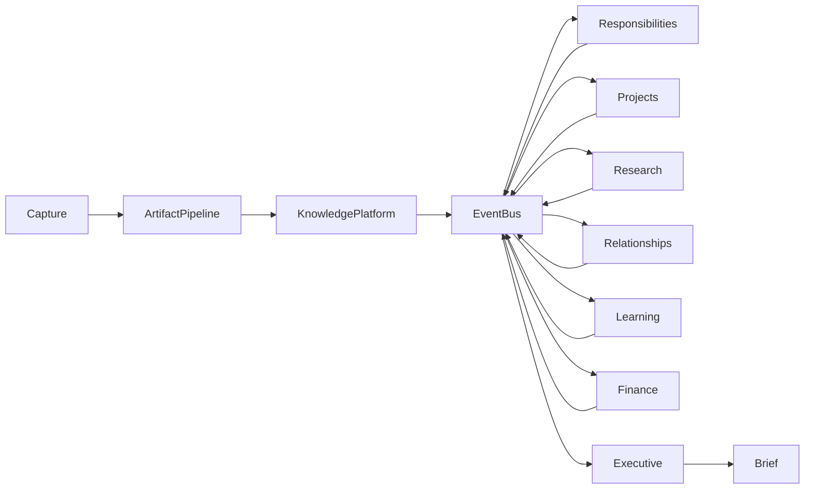

# ADR-0003: Event-Driven Architecture

**Status:** Accepted

**Date:** 2026-07-05

**Decision Makers:** Atlas Architecture Team

---

# Context

Atlas is not a collection of applications.

It is a continuously evolving system that transforms information into understanding.

Every day, new information enters the system:

- emails
- documents
- browser captures
- notes
- conversations
- calendar updates
- purchases
- research
- reminders
- sensor inputs
- manual edits

Each piece of information may influence many different parts of Atlas.

For example, a single email might:

- create a responsibility
- update a project
- modify a relationship
- generate a deadline
- change a priority
- affect the Executive Brief
- trigger opportunity detection

A traditional request-response architecture would tightly couple these components, making Atlas increasingly difficult to extend.

Atlas instead adopts an Event-Driven Architecture.

---

# Decision

Every meaningful state change within Atlas shall be represented as one or more immutable events.

Components communicate exclusively through published events rather than direct service-to-service invocation.

The Event Bus becomes the primary communication mechanism across the system.

Services react to events.

They do not orchestrate one another.

---

# Architectural Principle

Atlas processes knowledge as a sequence of events.

```
Capture

↓

Artifacts

↓

Knowledge Platform

↓

Events

↓

Specialist Services

↓

Executive Engine

↓

Executive Brief
```

Every layer contributes events.

Every layer consumes events.

---

# Why Events?

Events provide a natural representation of change.

Examples include:

- document imported
- artifact classified
- reminder completed
- task created
- relationship strengthened
- payment detected
- goal achieved
- project archived

Instead of asking:

> "Who should I call?"

Components ask:

> "What happened?"

---

# Event Bus

The Event Bus is the communication backbone of Atlas.

Responsibilities include:

- event publication
- subscription management
- routing
- delivery
- persistence
- replay support
- ordering guarantees
- version compatibility

The Event Bus contains no business logic.

Its responsibility is transport, not decision-making.

---

# Event Flow



Notice that specialists both consume and emit events.

Atlas continuously evolves through event propagation.

---

# Immutable Events

Events represent historical facts.

Facts cannot change.

Incorrect conclusions may later be corrected by new events, but historical events remain immutable.

Example:

```
DocumentImported

↓

DocumentClassified

↓

ProjectDetected

↓

ProjectArchived
```

Atlas records what happened.

It does not rewrite history.

---

# Event Characteristics

Every event should be:

- immutable
- timestamped
- uniquely identifiable
- versioned
- attributable
- explainable

Events should never contain ambiguous meaning.

An event represents exactly one occurrence.

---

# Loose Coupling

Services must never depend upon one another's implementations.

Instead:

```
Service A

publishes

↓

Event

↓

Service B

reacts
```

This enables:

- modularity
- independent deployment
- simpler testing
- easier extension
- plugin support

---

# Specialist Independence

Each Specialist owns its own reasoning.

Examples:

Responsibilities Service

subscribes to:

- DeadlineDetected
- ReminderCreated
- EmailClassified

Projects Service

subscribes to:

- ArtifactClassified
- NoteCreated
- RepositoryLinked

Relationship Service

subscribes to:

- MeetingCompleted
- ContactImported
- EmailReceived

No specialist directly invokes another specialist.

---

# Event Replay

Atlas should be capable of rebuilding internal state by replaying historical events.

Replay enables:

- rebuilding indexes
- debugging
- migration
- recovery
- experimentation
- new specialist initialization

Replay should not require modifying historical events.

---

# Event Versioning

Events evolve.

Breaking changes must never invalidate historical data.

Each event type shall include a version.

Consumers should support older event versions whenever practical.

Versioning strategy will be defined in the Event Model Specification.

---

# Idempotency

Event consumers should be idempotent.

Processing the same event multiple times must produce the same final state.

This protects Atlas from:

- retries
- synchronization duplication
- recovery operations
- replay

---

# Ordering

Ordering should be guaranteed only where necessary.

Examples:

Within a single artifact:

```
ArtifactCreated

↓

ArtifactProcessed

↓

ArtifactIndexed
```

Global ordering across unrelated events is unnecessary and should not be assumed.

---

# Long-Running Work

Long-running work should be represented as additional events rather than blocking execution.

Example:

```
DocumentImported

↓

OCRRequested

↓

OCRCompleted

↓

EntitiesExtracted

↓

KnowledgeUpdated
```

This allows Atlas to remain responsive while background processing continues.

---

# AI Integration

AI services participate as event consumers.

Example:

```
ArtifactCreated

↓

EmbeddingRequested

↓

EmbeddingGenerated

↓

KnowledgeUpdated
```

AI never becomes a special execution path.

It behaves like every other service.

---

# Plugins

Plugins integrate through events.

They may:

- subscribe
- publish
- enrich
- observe

Plugins must never bypass the Event Bus.

This ensures consistent auditing, debugging, and extensibility.

---

# Failure Handling

Failures should generate events.

Example:

```
EmbeddingGenerationFailed

OCRTimeout

SynchronizationFailed

PluginCrashed

CloudRequestRejected
```

Failures become observable parts of system history rather than hidden implementation details.

---

# Benefits

## Extensibility

New services require subscriptions rather than architectural modifications.

---

## Scalability

Independent services can evolve without affecting unrelated components.

---

## Observability

Every meaningful action becomes inspectable.

---

## Explainability

Atlas can answer:

> Why did this happen?

by tracing the event chain.

---

## Resilience

Failures remain isolated.

Services recover independently.

---

## Replayability

System state can be reconstructed from event history.

---

# Trade-offs

An Event-Driven Architecture introduces:

- eventual consistency
- asynchronous workflows
- event versioning
- replay complexity
- debugging across event chains

These trade-offs are accepted because they significantly improve long-term maintainability and extensibility.

---

# Alternatives Considered

## Direct Service Calls

Simple initially but produces tight coupling and increasing architectural rigidity.

Rejected.

---

## Shared Database Communication

Services infer changes by polling shared storage.

Rejected because it obscures intent and increases latency.

---

## Monolithic Orchestration

A central orchestrator coordinates every operation.

Rejected because it creates a single point of complexity and limits extensibility.

---

# Consequences

Every new subsystem must answer:

1. What events does it publish?
2. What events does it consume?
3. What events represent failure?
4. Can it replay history?
5. Is it idempotent?
6. Does it avoid direct dependencies on other services?

If these questions cannot be answered, the subsystem is not yet architecturally complete.

---

# Related Documents

- `docs/philosophy/atlas-philosophy.md`
- `docs/architecture/system-vision.md`
- `ADR-0001 - The Three-Language Rule`
- `ADR-0002 - Local-First Architecture`
- `docs/specifications/event-model.md` *(future)*
- `docs/specifications/plugin-contract.md` *(future)*

---

# Guiding Principle

> **Atlas does not execute workflows.**

> **Atlas reacts to reality.**

Reality changes through events.

Atlas understands the world by observing, recording, and responding to those events.
