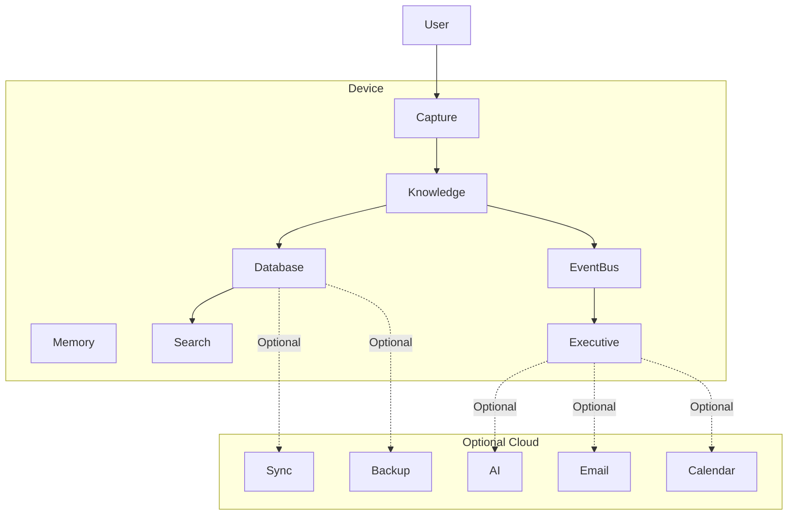

# ADR-0002: Local-First Architecture

**Status:** Accepted

**Date:** 2026-07-05

**Decision Makers:** Atlas Architecture Team

---

# Context

Atlas is a Personal Operating System.

Unlike traditional cloud-first productivity software, Atlas is intended to become the user's external executive function. As Atlas accumulates knowledge about responsibilities, projects, relationships, finances, research, personal documents, and long-term goals, the value—and sensitivity—of that information continuously increases.

This creates a fundamental architectural requirement:

> The user's knowledge must remain under the user's control.

Cloud-centric architectures introduce several undesirable properties:

- dependence on internet connectivity
- vendor lock-in
- unpredictable latency
- recurring infrastructure costs
- privacy risks
- regulatory complexity
- reduced user ownership

Atlas therefore adopts a Local-First Architecture.

---

# Decision

Atlas shall be designed as a **Local-First System**.

The local device is the authoritative source of truth for all user knowledge.

Cloud services are optional enhancements and must never become mandatory for the core operation of Atlas.

Every architectural proposal should begin with the question:

> Can this feature function entirely on the user's device?

If the answer is yes, the feature shall remain local.

If the answer is no, the cloud dependency must be explicitly justified and documented.

---

# Definition of Local-First

Within Atlas, "Local-First" means:

- User data is stored locally.
- Core functionality operates without internet access.
- Synchronization is optional.
- AI services are optional.
- Cloud providers are replaceable.
- The user owns their data.
- The system remains useful while offline.

Atlas should continue operating even if every external service becomes unavailable.

---

# Architectural Principles

## 1. Local is Canonical

The authoritative state of the system resides on the user's device.

Cloud replicas are secondary copies.

Synchronization must never redefine the user's local truth.

```
        Local Database
              │
      Canonical Truth
              │
      ┌───────┴────────┐
      ▼                ▼
Cloud Sync      Local Applications
```

---

## 2. Offline by Default

Internet access should enhance Atlas—not enable it.

Examples of offline capabilities include:

- note capture
- search
- project management
- knowledge graph queries
- executive brief generation
- reminders
- scheduling
- relationship tracking
- artifact processing
- local reasoning

The absence of a network connection should degrade capability gracefully rather than render Atlas unusable.

---

## 3. Cloud as a Dependency

Cloud services are treated as interchangeable dependencies.

Examples include:

- large language models
- cloud OCR
- remote backups
- synchronization
- calendar providers
- email providers
- cloud storage

These integrations should be abstracted behind interfaces rather than embedded into business logic.

---

## 4. User Ownership

The user owns:

- their knowledge
- their history
- their artifacts
- their relationships
- their metadata
- their models
- their configuration

Atlas should never require proprietary storage formats that prevent users from exporting their data.

---

# Architectural Model



Solid lines represent mandatory local components.

Dashed lines represent optional external integrations.

---

# Privacy Gateway

Every request leaving the device must pass through the Privacy Gateway.

The Privacy Gateway is responsible for:

- sensitivity detection
- redaction
- replacement
- abstraction
- minimization
- audit logging
- policy enforcement

No component may bypass the Privacy Gateway.

This requirement applies regardless of the cloud provider.

---

# Data Classification

Atlas should classify information before any external transmission.

Example classifications include:

| Classification | External Transmission |
|---------------|----------------------|
| Public | Allowed |
| Internal | Allowed with policy |
| Personal | Minimized |
| Sensitive | Redacted unless explicitly approved |
| Highly Sensitive | Local only by default |

The exact classification system is defined separately within the Privacy Gateway specification.

---

# Synchronization

Synchronization is not storage.

Synchronization exists solely to replicate the canonical local state across trusted devices.

Characteristics:

- eventually consistent
- resumable
- encrypted
- conflict-aware
- user-controlled

Synchronization must never require continuous connectivity.

---

# Artificial Intelligence

AI services are optional enhancements.

Atlas should always prefer deterministic logic when it can produce equivalent outcomes.

Examples:

Deterministic:

- scheduling
- reminders
- event routing
- filtering
- scoring
- rule evaluation
- deadline calculations

AI-assisted:

- summarization
- semantic search
- OCR
- speech recognition
- recommendation generation
- document understanding
- reasoning

Whenever deterministic logic is sufficient, deterministic logic shall be preferred.

---

# External Actions

Atlas may prepare external actions.

Atlas may never execute external actions without explicit user approval.

Examples include:

- sending email
- purchasing products
- submitting forms
- posting messages
- deleting information
- initiating financial transactions

This preserves user agency regardless of connectivity.

---

# Failure Modes

Atlas should continue operating during:

- internet outages
- AI provider failures
- synchronization failures
- authentication failures
- cloud service outages
- vendor shutdowns

Graceful degradation is preferred over service interruption.

---

# Benefits

## Privacy

Sensitive information remains under user control.

---

## Reliability

The system continues functioning regardless of internet availability.

---

## Longevity

Atlas remains viable even if third-party providers discontinue services.

---

## Cost

Core functionality incurs no recurring infrastructure cost.

---

## User Trust

Users can verify where their information resides and how it is processed.

---

# Trade-offs

A Local-First Architecture introduces additional complexity.

Examples include:

- synchronization
- conflict resolution
- local storage management
- incremental indexing
- device migration
- backup strategies

These complexities are accepted because they directly reinforce Atlas's mission and guiding principles.

---

# Alternatives Considered

## Cloud-First

A cloud-first architecture simplifies synchronization and enables centralized computation.

Rejected because it compromises privacy, resilience, and user ownership.

---

## Hybrid Cloud Authority

Cloud services maintain the canonical state while local devices cache data.

Rejected because it weakens offline capability and introduces dependency on external infrastructure.

---

## AI-Hosted Knowledge Base

Store user knowledge directly within an AI provider.

Rejected because it violates privacy, portability, transparency, and long-term sustainability.

---

# Consequences

Every new feature must answer the following questions during design review:

1. Does it function without internet access?
2. What information leaves the device?
3. Why must that information leave the device?
4. Can the transmitted data be minimized?
5. Can deterministic logic replace AI?
6. Does the Privacy Gateway inspect this request?
7. Can the feature recover from cloud failure?

If these questions cannot be answered satisfactorily, the architecture should be reconsidered.

---

# Implementation Implications

This ADR influences the design of:

- Artifact Pipeline
- Knowledge Graph
- Memory Engine
- Search Engine
- Event Bus
- Executive Engine
- Privacy Gateway
- Synchronization Service
- AI Integration Layer
- Plugin Runtime

Future implementation documents must assume that local execution is the default operating mode.

---

# Related Documents

- `docs/philosophy/atlas-philosophy.md`
- `docs/architecture/system-vision.md`
- `ADR-0001 - The Three-Language Rule`
- `ADR-0003 - Event-Driven Core`
- `docs/specifications/privacy-gateway.md` *(future)*
- `docs/specifications/synchronization.md` *(future)*

---

# Guiding Principle

> **User knowledge belongs to the user.**

Everything else—including cloud services, AI models, synchronization, and integrations—is replaceable.

The user's data is not.
