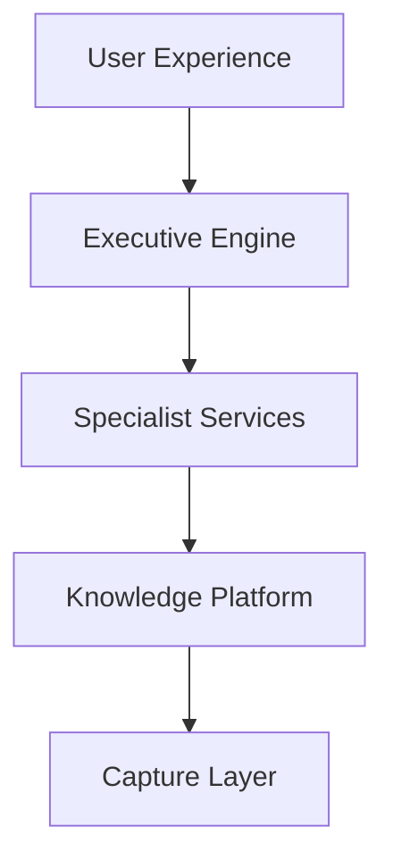
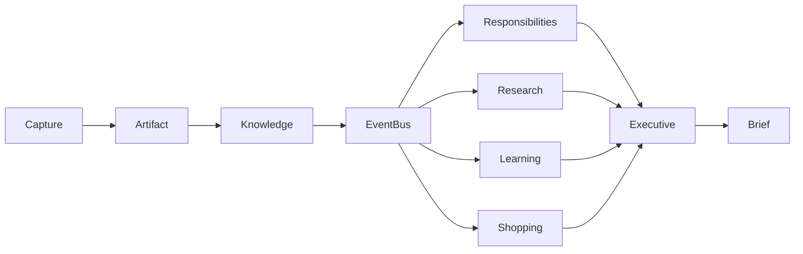

# Atlas System Architecture Vision

---

# Overview

Atlas is an event-driven Personal Operating System.

Rather than organizing features around applications, Atlas organizes the entire system around the lifecycle of knowledge.

```
Capture
    ↓
Artifacts
    ↓
Knowledge Platform
    ↓
Events
    ↓
Specialist Services
    ↓
Executive Engine
    ↓
Executive Brief
```

Every subsystem participates somewhere within this pipeline.

---

# Guiding Architectural Principles

- Local-first
- Event-driven
- Modular
- Explainable
- Privacy by default
- AI as dependency
- Human approval before external actions

---

# Layered Architecture



---

# Capture Layer

Responsible for acquiring information.

Examples:

- Voice
- Camera
- Documents
- Browser Extension
- Email
- Calendar
- Manual Notes
- Clipboard
- File Imports

Output:

Artifacts.

---

# Knowledge Platform

The heart of Atlas.

Responsible for transforming raw artifacts into structured knowledge.

Primary components:

- Artifact Pipeline
- Knowledge Graph
- Memory Engine
- Search Engine
- Event Bus

The Knowledge Platform contains no business logic.

It stores reality.

---

# Specialist Services

Each Specialist owns one domain.

Examples:

Core Services

- Responsibilities
- Projects
- Research
- Relationships
- Learning

Capability Modules

- Shopping
- Immigration
- Finance
- Formula 1
- Music Production
- Data Science

Each Specialist:

- subscribes to events
- updates its own models
- emits new events

Specialists never communicate directly.

Communication always occurs through the Event Bus.

---

# Executive Engine

The Executive Engine is Atlas' orchestration layer.

Inputs:

- events
- specialist outputs
- schedules
- user preferences
- goals

Outputs:

Executive Brief

Recommendations

Open loops

Priority changes

Opportunity detection

Risk detection

---

# Event-Driven Model



No service should directly invoke another service.

Everything communicates through events.

---

# Privacy Gateway

Every cloud request flows through the Privacy Gateway.

Responsibilities include:

- Sensitivity Detection
- Redaction
- Data Replacement
- Abstraction
- Policy Enforcement
- Audit Logging

The Privacy Gateway is mandatory.

There are no bypasses.

---

# Technology Strategy

Atlas intentionally limits itself to three languages.

## Go

Responsible for:

- Core runtime
- Event Bus
- Scheduler
- Plugin Runtime
- APIs
- Services

---

## TypeScript

Responsible for:

- React Native
- Desktop
- Browser Extension
- Shared Types
- Web Dashboard

---

## Python

Responsible for:

- OCR
- Embeddings
- Machine Learning
- Speech
- Advanced AI Processing

No additional language should be introduced without a documented Architectural Decision Record (ADR).

---

# Executive Brief

The Executive Brief represents the primary user experience.

Rather than reacting to commands, Atlas continuously prepares a daily synthesis of the user's current reality.

The Executive Brief answers one question:

> **What deserves my attention today?**

---

# Future Direction

As Atlas evolves, new capabilities should emerge through Specialists rather than changes to the core architecture.

The core operating system should remain stable while the ecosystem expands around it.

This separation allows Atlas to grow for decades without architectural drift.
