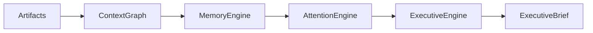

# Attention Engine Specification

**Document ID:** SPEC-0005

**Version:** 1.0

**Status:** Accepted

**Last Updated:** 2026-07-05

---

# Purpose

The Attention Engine determines what deserves the user's attention at any given moment.

It is responsible for transforming a rich, interconnected understanding of the user's world into a ranked set of attention candidates.

Unlike traditional notification systems, the Attention Engine is not designed to maximize engagement. It is designed to minimize cognitive load while preserving human agency.

The output of the Attention Engine becomes the primary input to the Executive Engine.

---

# Philosophy

Attention is Atlas's most valuable resource.

The Attention Engine exists to ensure that attention is:

- Earned
- Explainable
- Timely
- Relevant
- Respectful

Atlas should interrupt the user only when the expected value of the interruption exceeds its cognitive cost.

---

# Position in the Architecture

---

# Core Responsibilities

The Attention Engine is responsible for:

- Prioritization
- Opportunity ranking
- Risk ranking
- Deadline awareness
- Open loop management
- Interruption decisions
- Recommendation scoring
- Context-aware surfacing

It is **not** responsible for:

- Rendering the Executive Brief
- Storing knowledge
- Capturing information
- Executing external actions

---

# Inputs

The Attention Engine consumes:

- Context Graph
- Memory annotations
- Active goals
- Responsibilities
- Deadlines
- User preferences
- Current time
- Calendar context
- Recent activity
- Environmental context (when available)

---

# Attention Candidates

An attention candidate is any item that could reasonably deserve the user's attention.

Examples include:

- A looming deadline
- A neglected relationship
- A job opportunity
- A price drop
- A visa requirement
- An unanswered email
- A blocked project
- A new research finding
- A learning milestone

Candidates are generated by Specialist Services and enriched by the Context Graph.

---

# Scoring Dimensions

Every candidate is evaluated across multiple independent dimensions.

Suggested dimensions include:

| Dimension | Description |
|-----------|-------------|
| Urgency | Time sensitivity |
| Importance | Long-term significance |
| Confidence | Reliability of supporting evidence |
| Impact | Expected benefit of acting |
| Effort | Estimated effort required |
| Novelty | Whether the user has already seen it |
| Recency | Freshness of information |
| Alignment | Alignment with active goals |

No single dimension determines the outcome.

---

# Explainability

Every ranked candidate must answer:

- Why is this important?
- Why now?
- What evidence supports it?
- What happens if ignored?
- Which goals does it affect?

The user should never see an unexplained priority.

---

# Respectful Attention

The Attention Engine should prefer:

- Aggregation over interruption
- Daily synthesis over constant notifications
- Contextual reminders over repeated alerts

Silence is a valid decision.

Choosing not to interrupt the user is often the correct outcome.

---

# Opportunity Detection

Opportunities are surfaced when:

- They are actionable
- They align with user goals
- They are sufficiently supported by evidence
- Their expected value exceeds the cost of attention

Examples:

- Flight price drops
- Scholarship openings
- New job postings
- Relevant research publications
- Product discounts

---

# Risk Detection

Risks are surfaced when:

- A deadline is approaching
- A dependency is blocked
- A responsibility is neglected
- A financial threshold is exceeded
- A required document expires soon

Risks should include mitigation suggestions but never force action.

---

# Open Loops

Atlas tracks unresolved commitments.

Examples:

- Awaiting a reply
- Missing documentation
- Incomplete task
- Unanswered question

The Attention Engine decides when these loops should be resurfaced.

---

# Attention Budget

Human attention is finite.

The Attention Engine should operate within an implicit attention budget.

If ten items are equally valuable, Atlas should prefer presenting the most actionable subset rather than overwhelming the user.

---

# Deterministic First

Ranking should use deterministic logic whenever practical.

AI may assist with:

- summarization
- semantic grouping
- estimating effort
- identifying themes

AI should not replace transparent ranking criteria without strong justification.

---

# Outputs

The Attention Engine produces a ranked list of attention candidates.

Each candidate includes:

- Rank
- Score
- Evidence
- Explanation
- Suggested action
- Supporting artifacts
- Related goals
- Related responsibilities

This output is consumed by the Executive Engine.

---

# Non-Goals

The Attention Engine does **not**:

- Execute actions
- Send messages
- Purchase products
- Commit external changes

Its role is advisory.

---

# Related Documents

- SPEC-0004 Context Graph
- SPEC-0003 Artifact Model
- SPEC-0001 Event Model
- ADR-0002 Local-First Architecture
- ADR-0003 Event-Driven Architecture

---

# Guiding Principle

> **Attention is a scarce resource.**

The purpose of the Attention Engine is not to maximize interaction.

It is to maximize clarity.
