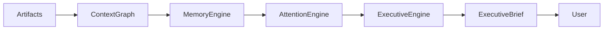

# Executive Brief Specification

**Document ID:** SPEC-0006

**Version:** 1.0

**Status:** Accepted

**Last Updated:** 2026-07-05

---

# Purpose

The Executive Brief is Atlas's primary user experience.

It is a synthesized, explainable briefing that helps the user understand their current situation and make better decisions with less cognitive effort.

The Executive Brief is **not** a notification feed, task list, inbox, or chat transcript.

It is a structured briefing prepared by Atlas that answers one question:

> **What deserves my attention today?**

---

# Philosophy

Atlas is a Chief of Staff.

A Chief of Staff does not tell you everything.

A Chief of Staff tells you what matters.

The Executive Brief exists to:

- Reduce cognitive load
- Preserve human agency
- Surface important information
- Explain why it matters
- Recommend without deciding

The brief is prepared by Atlas.

The decisions remain with the user.

---

# Position in the Architecture



---

# Design Principles

Every Executive Brief should be:

- Explainable
- Concise
- Actionable
- Contextual
- Evidence-backed
- Calm
- Respectful
- Non-manipulative

The goal is clarity, not completeness.

---

# Core Question

Every briefing should answer:

1. What deserves my attention?
2. Why does it matter?
3. Why now?
4. What happens if I ignore it?
5. What options do I have?

---

# Structure

The Executive Brief is composed of independent sections.

Each section may appear, be omitted, or change order depending on relevance.

Example structure:

```text
Executive Summary

Critical Items

Opportunities

Projects

Responsibilities

Calendar

Relationships

Finance

Learning

Research

Health of the System

Recently Completed

Open Questions
```

Sections are dynamically generated.

There is no fixed layout.

---

# Executive Summary

The summary should provide a concise overview of the current situation.

Typical content includes:

- Overall workload
- Emerging themes
- Key changes since the previous brief
- Significant opportunities
- Significant risks

The summary should be readable in under one minute.

---

# Critical Items

Critical Items represent issues requiring prompt awareness.

Examples:

- Deadlines
- Expiring visas
- Missed commitments
- Financial risks
- Time-sensitive opportunities

Every critical item must include:

- Explanation
- Evidence
- Suggested next step
- Confidence level

---

# Opportunities

Opportunities are positive developments that may benefit the user.

Examples:

- Job postings
- Scholarships
- Price reductions
- New research
- Relevant events
- Networking opportunities

Opportunities should be ranked by expected value.

---

# Projects

The Projects section highlights:

- Progress
- Blockers
- Milestones
- Momentum
- Suggested focus

Atlas should avoid reporting every project equally.

Only meaningful changes deserve inclusion.

---

# Responsibilities

Responsibilities include:

- Upcoming deadlines
- Deferred work
- Newly detected obligations
- Aging commitments

The purpose is situational awareness rather than task management.

---

# Calendar

The Calendar section provides context rather than merely listing events.

Examples:

- Meeting preparation
- Travel implications
- Scheduling conflicts
- Buffer recommendations

---

# Relationships

Atlas highlights relationships requiring attention.

Examples:

- Long time since last interaction
- Upcoming birthdays
- Follow-up opportunities
- Important conversations

Relationship recommendations should remain respectful and never manipulative.

---

# Finance

Financial highlights may include:

- Budget deviations
- Upcoming payments
- Subscription renewals
- Savings opportunities

Atlas should prioritize insight over transaction history.

---

# Learning

Learning recommendations should connect to active goals.

Examples:

- Relevant articles
- Course progress
- Practice reminders
- New research

Learning should be integrated with ongoing work rather than isolated.

---

# Research

Research updates include:

- Newly discovered sources
- Contradictory evidence
- Emerging trends
- Open questions

Atlas should distinguish verified information from hypotheses.

---

# Recently Completed

Completed work provides closure and reinforces progress.

Examples:

- Finished projects
- Resolved issues
- Achieved milestones

This section should remain concise.

---

# Open Questions

Atlas explicitly tracks uncertainty.

Examples:

- Missing documentation
- Unanswered emails
- Incomplete research
- Conflicting information

Surfacing uncertainty is preferable to presenting false confidence.

---

# Recommendation Format

Every recommendation should answer:

- What?
- Why?
- Why now?
- Supporting evidence
- Suggested actions
- Confidence

Recommendations should avoid imperative language.

Prefer:

> "You may wish to..."

Over:

> "You should..."

---

# Attention Budget

The Executive Brief must respect the user's limited attention.

Guidelines:

- Prioritize depth over breadth
- Avoid duplicate information
- Group related items
- Suppress low-value noise

The absence of a section is preferable to including low-value content.

---

# Explainability

Every section must be traceable.

The user should be able to inspect:

```
Recommendation
    ↓
Attention Candidate
    ↓
Context Graph
    ↓
Evidence
    ↓
Artifacts
```

Nothing should appear without an explanation.

---

# Human Agency

The Executive Brief may:

- Recommend
- Explain
- Compare
- Prioritize
- Challenge assumptions

It must never:

- Make irreversible decisions
- Execute external actions
- Hide alternatives
- Pressure the user

For actions with external consequences, Atlas prepares; the user commits.

---

# Delivery Modes

The same briefing should adapt to multiple interfaces.

Examples:

- Mobile
- Desktop
- Voice
- Smartwatch summary
- Printable PDF

The content remains consistent; only the presentation changes.

---

# Personalization

The Executive Brief should adapt over time based on:

- User preferences
- Interaction history
- Goals
- Feedback

Personalization should improve relevance without creating filter bubbles.

Atlas may intentionally surface important information that conflicts with the user's expectations when supported by evidence.

---

# Success Metrics

The quality of an Executive Brief should be evaluated by outcomes such as:

- Reduced missed deadlines
- Reduced context switching
- Faster decision making
- Increased follow-through
- User trust
- Reduced cognitive load

Time spent reading the brief is **not** a success metric.

---

# Non-Goals

The Executive Brief is not:

- A notification center
- A to-do list
- A social feed
- A chatbot transcript
- An activity log

Its purpose is synthesis, not aggregation.

---

# Related Documents

- SPEC-0005 Attention Engine
- SPEC-0004 Context Graph
- SPEC-0003 Artifact Model
- SPEC-0001 Event Model
- ADR-0002 Local-First Architecture

---

# Guiding Principle

> **The Executive Brief exists to create clarity, not activity.**

Success is measured not by how much information Atlas presents, but by how confidently and calmly the user can decide what to do next.
