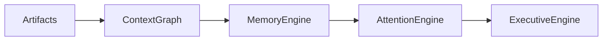

# Memory Engine Specification

**Document ID:** SPEC-0007

**Version:** 1.0

**Status:** Accepted

**Last Updated:** 2026-07-05

---

# Purpose

The Memory Engine enables Atlas to develop long-term understanding of the user's world.

While the Context Graph models the current state of understanding, the Memory Engine models how that understanding evolves over time.

Its purpose is not to remember everything.

Its purpose is to remember what matters.

---

# Philosophy

Memory is selective.

Humans forget most experiences.

What remains is shaped by:

- repetition
- emotional significance
- usefulness
- novelty
- goals
- context

Atlas should behave similarly.

The Memory Engine exists to model significance rather than permanence.

---

# Position in the Architecture



---

# Responsibilities

The Memory Engine is responsible for:

- Memory formation
- Memory strengthening
- Memory decay
- Habit detection
- Pattern detection
- Long-term relevance
- Context reinforcement
- Retrieval assistance

It is **not** responsible for:

- Storing artifacts
- Managing graph relationships
- Prioritization
- UI generation

---

# Core Principle

Everything may be stored.

Not everything should be remembered.

---

# Memory Formation

A memory is formed when Atlas determines that information has persistent value beyond its original context.

Examples:

- Frequently visited topics
- Long-term goals
- Important relationships
- Recurring projects
- User preferences
- Stable routines

---

# Memory Types

## Semantic Memory

General knowledge about the user's world.

Examples:

- Favorite programming languages
- Preferred airlines
- Immigration history
- Financial institutions
- Career goals

---

## Episodic Memory

Specific experiences.

Examples:

- Interview with Company X
- Vacation in Japan
- Atlas v1 launch
- Graduation ceremony

---

## Procedural Memory

Patterns of behavior.

Examples:

- Morning planning routine
- Weekly budgeting
- Research workflow
- Coding habits

---

## Preference Memory

Stable user preferences.

Examples:

- Dark theme
- Morning brief
- Markdown export
- Local AI preferred

---

## Relationship Memory

Long-term understanding of people.

Examples:

- Frequency of interaction
- Shared projects
- Important conversations
- Significant milestones

---

# Memory Formation Signals

A memory becomes stronger through signals such as:

- Repetition
- Manual pinning
- User correction
- Goal relevance
- Frequent retrieval
- Cross-domain references
- Explicit confirmation

---

# Memory Strength

Every memory has a continuously evolving strength score.

Conceptually:

```
Dormant

↓

Weak

↓

Established

↓

Strong

↓

Core
```

Strength is dynamic rather than permanent.

---

# Memory Decay

Memories naturally weaken when:

- Never referenced
- No longer relevant
- Superseded
- Explicitly forgotten

Decay removes clutter.

It does not erase history.

---

# Memory Reinforcement

Memories strengthen through:

- repeated observations
- recurring events
- user interaction
- successful recommendations
- goal alignment

Atlas learns importance over time.

---

# Memory Retrieval

The Memory Engine supports contextual retrieval.

Examples:

Current topic:

```
Canada

↓

Immigration

↓

Previous research

↓

Past conversations

↓

Open applications
```

Retrieval is context-aware rather than keyword-driven.

---

# Habit Detection

Habits emerge from repeated behavior.

Examples:

- Reads every morning
- Budgets on Sundays
- Writes blog posts monthly
- Exercises after work

Habits are inferred cautiously.

Atlas should distinguish habits from coincidences.

---

# Pattern Detection

Patterns extend beyond habits.

Examples:

- Frequently delays finance tasks
- Performs best after uninterrupted work
- Learns faster through projects
- Research spikes before interviews

Patterns inform future recommendations.

---

# Forgetting

Atlas supports intentional forgetting.

Users may request:

- Forget a memory
- Reduce importance
- Ignore future occurrences

Forgetting should affect memory, not historical artifacts.

Artifacts remain evidence.

---

# Memory and Explainability

Every memory must answer:

- Why does this exist?
- What evidence supports it?
- When was it last reinforced?
- How confident is Atlas?

Memory is never opaque.

---

# Memory vs Context Graph

The Context Graph answers:

> What is true?

The Memory Engine answers:

> What continues to matter?

These responsibilities must remain distinct.

---

# Memory and Attention

The Memory Engine does not decide what deserves attention.

Instead, it provides historical significance to the Attention Engine.

Example:

```
Upcoming conference

↓

Related to long-term goal

↓

Frequently researched topic

↓

High memory strength

↓

Higher attention score
```

---

# Replay

The Memory Engine must be reconstructable from:

- Artifacts
- Events
- Context Graph

Memory is derived state.

It is never the sole source of truth.

---

# Privacy

Memories inherit sensitivity from supporting evidence.

Additional privacy rules may strengthen protections for inferred memories.

---

# AI

AI may assist with:

- pattern recognition
- clustering
- semantic similarity

However:

Memory formation should prefer deterministic heuristics whenever practical.

---

# Non-Goals

The Memory Engine is not:

- A vector database
- A cache
- A bookmark system
- A favorites list
- A recommendation engine

It models significance over time.

---

# Related Documents

- SPEC-0003 Artifact Model
- SPEC-0004 Context Graph
- SPEC-0005 Attention Engine
- SPEC-0006 Executive Brief
- SPEC-0001 Event Model

---

# Guiding Principle

> Atlas remembers significance, not just information.

The purpose of memory is not perfect recall.

The purpose of memory is better judgment.
