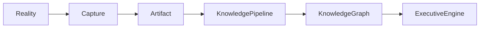
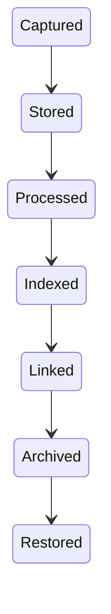

# Artifact Model Specification

**Document ID:** SPEC-0003

**Version:** 1.0

**Status:** Accepted

**Last Updated:** 2026-07-05

---

# Purpose

Artifacts are the fundamental unit of information within Atlas.

Everything Atlas knows originates from one or more artifacts.

This specification defines:

- What an artifact is
- Artifact lifecycle
- Artifact identity
- Metadata
- Provenance
- Processing pipeline
- Relationships
- Versioning
- Storage principles

The Artifact Model forms the boundary between the external world and the Atlas Knowledge Platform.

---

# Philosophy

Atlas does not directly understand reality.

It understands **artifacts that represent reality**.

Examples include:

- a PDF
- an email
- a screenshot
- a photograph
- a voice recording
- a calendar event
- a receipt
- a browser page
- a chat message
- a handwritten note
- a CSV file

Artifacts are immutable evidence.

Knowledge is derived from artifacts.

---

# Definition

An artifact is:

> **An immutable digital representation of information captured by Atlas or imported into Atlas.**

Artifacts represent observations.

They are not interpretations.

---

# Position in the Architecture



Artifacts separate acquisition from understanding.

---

# Design Goals

Artifacts must be:

- Immutable
- Addressable
- Explainable
- Replayable
- Version-aware
- Searchable
- Traceable
- Privacy-aware

---

# Canonical Structure

Every artifact consists of three logical sections.

```text
Artifact
├── Identity
├── Metadata
└── Content
```

Derived information is **not** stored inside the artifact.

---

# Identity

Every artifact receives a permanent identifier.

Identity includes:

| Field | Description |
|---------|-------------|
| Artifact ID | Globally unique identifier |
| Type | Artifact category |
| Created At | Initial capture time |
| Imported At | Time Atlas received it |
| Source | Originating capture system |

Identity never changes.

---

# Artifact Types

Atlas supports many artifact categories.

Examples include:

## Documents

- PDF
- Word
- Markdown
- Plain text

---

## Images

- Photograph
- Screenshot
- Diagram
- Whiteboard
- Receipt

---

## Audio

- Voice memo
- Meeting recording
- Podcast clip

---

## Video

- Recording
- Screen capture

---

## Browser

- Full page
- Selection
- Bookmark
- Article
- Tab session

---

## Communication

- Email
- Chat message
- SMS
- Notification

---

## Structured Data

- Calendar event
- Contact
- CSV
- JSON
- Spreadsheet

---

## User Generated

- Note
- Task draft
- Checklist
- Journal entry

---

# Metadata

Metadata describes the artifact without interpreting it.

Examples:

| Field | Description |
|---------|-------------|
| MIME Type | Original media type |
| Size | Bytes |
| Language | Detected language |
| Encoding | Character encoding |
| Hash | Integrity verification |
| Filename | Original filename |
| Source Application | Where it originated |
| Capture Device | Optional |
| Time Zone | Original timezone |

Metadata should remain factual.

---

# Provenance

Atlas preserves where every artifact came from.

Example:

```
Chrome

↓

Wikipedia

↓

Article

↓

Browser Capture

↓

Artifact
```

Another example:

```
Camera

↓

Receipt

↓

Artifact
```

Provenance enables explainability.

---

# Content

Content stores the original information.

Examples:

- original PDF
- image bytes
- audio recording
- HTML
- Markdown
- plain text

Content is never replaced by derived information.

---

# Derived Knowledge

Artifacts do **not** contain:

- summaries
- embeddings
- entities
- relationships
- priorities
- recommendations

These belong elsewhere.

Instead:

```
Artifact

↓

Knowledge Pipeline

↓

Knowledge Graph

↓

Events
```

This separation preserves immutability.

---

# Artifact Lifecycle



The original artifact remains unchanged throughout the lifecycle.

---

# Processing Pipeline

Artifacts progress through deterministic stages.

```
Captured

↓

Validated

↓

Stored

↓

Classified

↓

Indexed

↓

Extracted

↓

Linked

↓

Available
```

Not every artifact requires every stage.

---

# Relationships

Artifacts may relate to:

- entities
- projects
- responsibilities
- contacts
- research
- conversations
- memories
- events

Relationships are maintained by the Knowledge Graph.

Artifacts remain independent.

---

# Versioning

Artifacts are immutable.

Corrections produce new artifacts.

Example:

```
MeetingNotes_v1

↓

MeetingNotes_v2
```

Both remain part of system history.

---

# Deduplication

Atlas should detect duplicate artifacts using content hashing.

Duplicates should:

- reference the existing artifact
- preserve independent provenance
- avoid duplicate storage when practical

Deduplication must never lose provenance.

---

# Privacy

Artifacts inherit sensitivity classifications.

Example levels:

- Public
- Internal
- Personal
- Sensitive
- Highly Sensitive

The classification informs downstream processing through the Privacy Gateway.

---

# Encryption

Artifacts should be encrypted at rest.

Sensitive artifacts may use stronger encryption policies as defined by future security specifications.

Encryption strategy is intentionally implementation-independent.

---

# Search

Search indexes reference artifacts.

They do not replace them.

Deleting an index must never destroy the original artifact.

---

# Synchronization

Artifacts synchronize independently of derived knowledge.

This enables:

- incremental synchronization
- efficient conflict resolution
- deterministic reconstruction
- selective device replication

---

# Explainability

Atlas should always be capable of answering:

> Why do I know this?

The answer begins with one or more artifacts.

Example:

```
Recommendation

↓

Knowledge Graph

↓

Research Entity

↓

Browser Capture

↓

Artifact
```

Every recommendation ultimately traces back to evidence.

---

# Non-Goals

Artifacts are **not**:

- tasks
- projects
- memories
- entities
- graph nodes
- recommendations
- AI prompts

Artifacts represent evidence.

Other models represent understanding.

---

# Related Documents

- `docs/specifications/event-model.md`
- `docs/specifications/event-catalog.md`
- `docs/specifications/knowledge-graph.md`
- `ADR-0002 - Local-First Architecture`
- `ADR-0003 - Event-Driven Architecture`

---

# Guiding Principle

> **Artifacts preserve reality.**

Atlas may reinterpret an artifact as its understanding evolves, but the artifact itself remains an immutable record of what was originally observed.

Knowledge changes.

Evidence does not.
