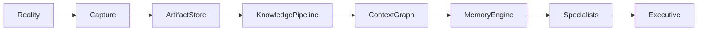

# Context Graph Specification

**Document ID:** SPEC-0004

**Version:** 1.0

**Status:** Accepted

**Last Updated:** 2026-07-05

---

# Purpose

The Context Graph is Atlas' central representation of understanding.

It transforms evidence into connected knowledge that can be reasoned about by Specialists and the Executive Engine.

Unlike traditional knowledge graphs, the Context Graph models not only facts but also context, uncertainty, relevance, provenance, and temporal change.

The Context Graph answers questions such as:

- What is this?
- How is it connected?
- Why does Atlas believe this?
- How important is it?
- How recent is it?
- What depends on it?
- What deserves attention?

---

# Philosophy

Artifacts preserve reality.

The Context Graph represents Atlas' current understanding of reality.

Understanding is expected to evolve.

The graph is therefore a living model rather than a permanent record.

---

# Position in the Architecture



---

# Design Goals

The Context Graph should be:

- Explainable
- Incrementally updateable
- Replayable
- Queryable
- Version-aware
- Confidence-aware
- Evidence-backed
- Extensible

---

# Core Principle

Nothing exists in the Context Graph without evidence.

Every node and relationship must ultimately trace back to one or more artifacts.

Atlas never stores unsupported conclusions.

---

# Graph Structure

```text
Context Graph

├── Nodes
├── Edges
├── Evidence
├── Confidence
├── Temporal Information
├── Importance
├── Provenance
└── Metadata
```

---

# Nodes

Nodes represent identifiable concepts.

Examples include:

- Person
- Organization
- Project
- Responsibility
- Goal
- Skill
- Interest
- Topic
- Book
- Article
- Company
- Location
- Event
- Product
- Calendar Event
- Music Album
- Formula 1 Team

Nodes represent meaning rather than files.

---

# Edges

Edges describe relationships.

Examples:

```
WORKS_ON

OWNS

RELATED_TO

MENTIONED_IN

PART_OF

DEPENDS_ON

LOCATED_IN

INTERESTED_IN

BLOCKED_BY

REFERENCES

LEARNS

MEMBER_OF
```

Edges are directional unless explicitly defined as symmetric.

---

# Evidence

Every node and edge references one or more artifacts.

Example:

```
Browser Capture

↓

Article

↓

Artifact

↓

Node:
OpenTelemetry

↓

Relationship:
USES

↓

Project Atlas
```

Evidence is mandatory.

---

# Confidence

Every inferred fact includes confidence.

Example:

```
95%

Likely

Possible

Unknown
```

Confidence allows Atlas to distinguish observations from inferences.

---

# Importance

Every node carries an importance score.

Importance is dynamic.

Factors include:

- user goals
- active projects
- deadlines
- frequency
- relationships
- historical significance

Importance is recalculated rather than permanently stored whenever possible.

---

# Temporal Context

Understanding changes over time.

Nodes therefore include:

- Created
- First Observed
- Last Observed
- Last Updated
- Expiration (optional)

Relationships also evolve over time.

---

# Provenance

Atlas should explain every connection.

Example:

```
Why is Alice linked to Project Atlas?

↓

Meeting Notes

↓

Email

↓

Git Repository

↓

Calendar Event
```

Explainability begins with provenance.

---

# Memories

The Memory Engine does not duplicate the graph.

Instead, memories annotate nodes and relationships.

Examples:

- Frequently accessed
- Personally important
- Long-term goal
- Strong relationship
- Frequently discussed

Memory enriches understanding rather than replacing it.

---

# Open Loops

The Context Graph models unresolved work.

Examples:

- unanswered question
- missing document
- pending decision
- unfinished project
- unresolved dependency

These become inputs to the Executive Engine.

---

# Opportunities

Atlas explicitly represents opportunities.

Examples:

- Product discount
- Scholarship discovered
- Visa window opened
- Job posting
- Research breakthrough

Opportunities are first-class graph objects.

---

# Risks

Likewise, risks are represented explicitly.

Examples:

- Expiring visa
- Budget overrun
- Missed deadline
- Weak relationship
- Missing documentation

Risks become Executive Engine inputs.

---

# Goals

Goals are graph nodes.

Goals connect to:

- Projects
- Responsibilities
- Learning
- Finances
- Relationships

This allows Atlas to reason about alignment.

---

# Context over Facts

Atlas should avoid storing isolated facts.

Instead:

```
Book

↓

Author

↓

Research Topic

↓

Current Project

↓

Learning Goal
```

Context is more valuable than raw information.

---

# Queries

The graph should support questions such as:

- What is currently blocking this project?
- What research relates to immigration?
- Which responsibilities affect this goal?
- Which people haven't I contacted recently?
- What evidence supports this recommendation?

---

# Replay

The Context Graph should be reconstructable.

Replay sequence:

```
Artifacts

↓

Events

↓

Extraction

↓

Graph

↓

Memory

↓

Executive
```

No graph state should be irreplaceable.

---

# Explainability

Every recommendation should support:

```
Recommendation

↓

Graph Node

↓

Relationships

↓

Evidence

↓

Artifacts
```

Atlas should never answer:

"Because the AI said so."

---

# AI

AI contributes understanding.

It does not own it.

LLMs, embeddings, and classifiers produce evidence that updates the graph.

The graph remains the canonical representation.

---

# Storage Independence

This specification intentionally avoids prescribing:

- graph database
- relational database
- vector database
- serialization format

The Context Graph is a conceptual model.

Storage is an implementation detail.

---

# Related Documents

- SPEC-0003 Artifact Model
- SPEC-0001 Event Model
- ADR-0002 Local-First Architecture
- ADR-0003 Event-Driven Architecture

---

# Guiding Principle

> The Artifact Store preserves reality.

> The Context Graph preserves understanding.

Reality is observed.

Understanding is constructed.
