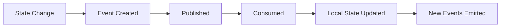

# Event Model Specification

**Document ID:** SPEC-0001

**Version:** 1.0

**Status:** Accepted

**Last Updated:** 2026-07-05

---

# Purpose

This document defines the canonical Event Model used throughout Atlas.

Every meaningful state change within Atlas is represented by one or more immutable events.

This specification defines:

- Event structure
- Naming conventions
- Lifecycle
- Versioning
- Metadata
- Ordering
- Replay behavior
- Idempotency
- Correlation
- Causation

All services, plugins, and future extensions must conform to this specification.

---

# Goals

The Event Model is designed to ensure that events are:

- Immutable
- Explainable
- Replayable
- Versioned
- Auditable
- Extensible
- Transport-agnostic
- Storage-agnostic

The specification intentionally avoids assumptions about the implementation of the Event Bus.

---

# Event Philosophy

Atlas models **facts**, not commands.

An event answers:

> **"What happened?"**

It never answers:

> **"What should happen?"**

Examples:

✔️ `DocumentImported`

✔️ `ReminderCompleted`

✔️ `DeadlineDetected`

✔️ `EmailClassified`

✖️ `ImportDocument`

✖️ `GenerateEmbedding`

✖️ `UpdateProject`

✖️ `NotifyUser`

Commands belong within service implementations.

Events belong in system history.

---

# Event Lifecycle



Services do not invoke each other.

They react to events.

---

# Canonical Event Structure

Every event shall conform to the following logical structure.

```text
Event
├── Metadata
├── Payload
└── Provenance
```

---

# Metadata

Every event must contain the following metadata.

| Field | Description |
|---------|-------------|
| Event ID | Globally unique identifier |
| Event Type | Canonical event name |
| Version | Event schema version |
| Timestamp | UTC creation time |
| Source | Producing service |
| Correlation ID | Groups related events |
| Causation ID | Immediate parent event |
| Actor | Human, system, or plugin |
| Sensitivity | Privacy classification |

Metadata enables tracing, replay, auditing, and debugging.

---

## Event ID

Every event receives a globally unique identifier.

Requirements:

- Immutable
- Never reused
- Stable across synchronization
- Unique across devices

Consumers must not infer meaning from Event IDs.

---

## Event Type

Event types describe completed facts.

Naming convention:

```
SubjectPastTense
```

Examples:

```
ArtifactCaptured

DocumentImported

ProjectCreated

GoalCompleted

DeadlineDetected

ReminderDismissed

PurchaseRecorded
```

Avoid verbs that imply intention.

---

## Timestamp

Events record the moment they occurred.

All timestamps must be stored in UTC.

Local time is derived at presentation.

---

## Version

Every event schema includes an explicit version.

```
Version: 1
```

Version numbers increase only when the event schema changes.

Consumers should support older versions whenever practical.

---

## Source

Identifies the producing component.

Examples:

```
capture.camera

capture.browser

knowledge.pipeline

research.specialist

projects.specialist

plugin.spotify

privacy.gateway
```

Source names should remain stable.

---

## Correlation ID

Correlation IDs group related events into a single logical operation.

Example:

```
Browser Capture

↓

ArtifactCaptured

↓

OCRCompleted

↓

EntitiesExtracted

↓

KnowledgeUpdated

↓

ResearchUpdated
```

All events generated from this operation share the same Correlation ID.

---

## Causation ID

Causation identifies the immediate parent event.

Example:

```
ArtifactCaptured
        │
        ▼
OCRRequested
        │
        ▼
OCRCompleted
        │
        ▼
EntitiesExtracted
```

Each child references the event that directly caused it.

---

## Actor

Every event identifies who or what initiated it.

Possible values include:

- User
- System
- Scheduler
- Plugin
- AI
- Synchronization

This supports explainability.

---

## Sensitivity

Events inherit a privacy classification.

Possible examples:

- Public
- Internal
- Personal
- Sensitive
- HighlySensitive

The Privacy Gateway uses this classification when evaluating outbound requests.

---

# Payload

The payload contains domain-specific information.

Example:

```
DocumentImported

Payload

Filename

File Type

Checksum

Artifact ID

Size
```

Payloads should contain only information required to describe the event.

Derived information belongs in future events.

---

# Provenance

Atlas tracks where information originated.

Example:

```
Browser

↓

Web Page

↓

Article

↓

Research Note

↓

Knowledge Graph
```

Every event should preserve provenance whenever practical.

This enables Atlas to explain:

> "Why do I know this?"

---

# Event Immutability

Events are permanent historical facts.

Once published:

- no edits
- no deletion
- no mutation

Corrections are represented through additional events.

Example:

```
ProjectDetected

↓

ProjectMerged

↓

ProjectArchived
```

History remains intact.

---

# Event Ordering

Ordering is guaranteed only within a single causal chain.

Example:

```
ArtifactCaptured

↓

ArtifactParsed

↓

KnowledgeUpdated
```

No assumptions should be made regarding unrelated events.

Atlas intentionally favors scalability over global ordering.

---

# Replay

Every event should be replayable.

Replay enables:

- rebuilding search indexes
- rebuilding the knowledge graph
- initializing new specialists
- debugging
- migrations
- recovery

Replay must produce deterministic results.

---

# Idempotency

Consumers must be idempotent.

# Event Model Specification

**Document ID:** SPEC-0001

**Version:** 1.0

**Status:** Accepted

**Last Updated:** 2026-07-05

---

# Purpose

This document defines the canonical Event Model used throughout Atlas.

Every meaningful state change within Atlas is represented by one or more immutable events.

This specification defines:

- Event structure
- Naming conventions
- Lifecycle
- Versioning
- Metadata
- Ordering
- Replay behavior
- Idempotency
- Correlation
- Causation

All services, plugins, and future extensions must conform to this specification.

---

# Goals

The Event Model is designed to ensure that events are:

- Immutable
- Explainable
- Replayable
- Versioned
- Auditable
- Extensible
- Transport-agnostic
- Storage-agnostic

The specification intentionally avoids assumptions about the implementation of the Event Bus.

---

# Event Philosophy

Atlas models **facts**, not commands.

An event answers:

> **"What happened?"**

It never answers:

> **"What should happen?"**

Examples:

✔️ `DocumentImported`

✔️ `ReminderCompleted`

✔️ `DeadlineDetected`

✔️ `EmailClassified`

✖️ `ImportDocument`

✖️ `GenerateEmbedding`

✖️ `UpdateProject`

✖️ `NotifyUser`

Commands belong within service implementations.

Events belong in system history.

---

# Event Lifecycle


Services do not invoke each other.

They react to events.

---

# Canonical Event Structure

Every event shall conform to the following logical structure.

```text
Event
├── Metadata
├── Payload
└── Provenance
```

---

# Metadata

Every event must contain the following metadata.

| Field | Description |
|---------|-------------|
| Event ID | Globally unique identifier |
| Event Type | Canonical event name |
| Version | Event schema version |
| Timestamp | UTC creation time |
| Source | Producing service |
| Correlation ID | Groups related events |
| Causation ID | Immediate parent event |
| Actor | Human, system, or plugin |
| Sensitivity | Privacy classification |

Metadata enables tracing, replay, auditing, and debugging.

---

## Event ID

Every event receives a globally unique identifier.

Requirements:

- Immutable
- Never reused
- Stable across synchronization
- Unique across devices

Consumers must not infer meaning from Event IDs.

---

## Event Type

Event types describe completed facts.

Naming convention:

```
SubjectPastTense
```

Examples:

```
ArtifactCaptured

DocumentImported

ProjectCreated

GoalCompleted

DeadlineDetected

ReminderDismissed

PurchaseRecorded
```

Avoid verbs that imply intention.

---

## Timestamp

Events record the moment they occurred.

All timestamps must be stored in UTC.

Local time is derived at presentation.

---

## Version

Every event schema includes an explicit version.

```
Version: 1
```

Version numbers increase only when the event schema changes.

Consumers should support older versions whenever practical.

---

## Source

Identifies the producing component.

Examples:

```
capture.camera

capture.browser

knowledge.pipeline

research.specialist

projects.specialist

plugin.spotify

privacy.gateway
```

Source names should remain stable.

---

## Correlation ID

Correlation IDs group related events into a single logical operation.

Example:

```
Browser Capture

↓

ArtifactCaptured

↓

OCRCompleted

↓

EntitiesExtracted

↓

KnowledgeUpdated

↓

ResearchUpdated
```

All events generated from this operation share the same Correlation ID.

---

## Causation ID

Causation identifies the immediate parent event.

Example:

```
ArtifactCaptured
        │
        ▼
OCRRequested
        │
        ▼
OCRCompleted
        │
        ▼
EntitiesExtracted
```

Each child references the event that directly caused it.

---

## Actor

Every event identifies who or what initiated it.

Possible values include:

- User
- System
- Scheduler
- Plugin
- AI
- Synchronization

This supports explainability.

---

## Sensitivity

Events inherit a privacy classification.

Possible examples:

- Public
- Internal
- Personal
- Sensitive
- HighlySensitive

The Privacy Gateway uses this classification when evaluating outbound requests.

---

# Payload

The payload contains domain-specific information.

Example:

```
DocumentImported

Payload

Filename

File Type

Checksum

Artifact ID

Size
```

Payloads should contain only information required to describe the event.

Derived information belongs in future events.

---

# Provenance

Atlas tracks where information originated.

Example:

```
Browser

↓

Web Page

↓

Article

↓

Research Note

↓

Knowledge Graph
```

Every event should preserve provenance whenever practical.

This enables Atlas to explain:

> "Why do I know this?"

---

# Event Immutability

Events are permanent historical facts.

Once published:

- no edits
- no deletion
- no mutation

Corrections are represented through additional events.

Example:

```
ProjectDetected

↓

ProjectMerged

↓

ProjectArchived
```

History remains intact.

---

# Event Ordering

Ordering is guaranteed only within a single causal chain.

Example:

```
ArtifactCaptured

↓

ArtifactParsed

↓

KnowledgeUpdated
```

No assumptions should be made regarding unrelated events.

Atlas intentionally favors scalability over global ordering.

---

# Replay

Every event should be replayable.

Replay enables:

- rebuilding search indexes
- rebuilding the knowledge graph
- initializing new specialists
- debugging
- migrations
- recovery

Replay must produce deterministic results.

---

# Idempotency

Consumers must be idempotent.

Receiving the same event twice must not produce duplicate state.

Example:

```
TaskCreated

↓

TaskAlreadyExists

↓

Ignored
```

Idempotency is mandatory.

---

# Event Versioning

Schema evolution must preserve compatibility.

Allowed changes:

- adding optional fields
- adding metadata
- expanding enumerations

Breaking changes require a new version.

Historical events are never rewritten.

---

# Event Categories

Atlas groups events into broad categories.

## Capture

Examples:

- DocumentImported
- VoiceRecorded
- BrowserCaptured
- ImageCaptured

---

## Knowledge

Examples:

- EntityCreated
- RelationshipDiscovered
- ArtifactClassified
- SummaryGenerated

---

## Executive

Examples:

- PriorityChanged
- OpportunityDetected
- RiskDetected
- ExecutiveBriefGenerated

---

## Specialist

Examples:

- ProjectArchived
- DeadlineDetected
- RelationshipStrengthened
- GoalCompleted

---

## Infrastructure

Examples:

- PluginInstalled
- SynchronizationCompleted
- BackupCreated
- CloudRequestRejected

---

# Event Chains

Most Atlas operations generate multiple events.

Example:

```text
User saves PDF

↓

DocumentImported

↓

ArtifactCreated

↓

OCRRequested

↓

OCRCompleted

↓

EntitiesExtracted

↓

KnowledgeUpdated

↓

ResearchUpdated

↓

ExecutiveBriefUpdated
```

Each event records only one completed fact.

---

# Event Bus Responsibilities

The Event Bus is responsible for:

- delivery
- routing
- persistence
- subscriptions
- replay
- acknowledgements
- dead-letter handling
- ordering guarantees

The Event Bus is **not** responsible for business logic.

---

# Error Events

Failures are represented as events.

Examples:

```
OCRFailed

PluginCrashed

EmbeddingGenerationFailed

SynchronizationRejected

CloudRequestDenied
```

Failures become observable history.

---

# Explainability

Atlas should be capable of answering questions such as:

- Why was this recommendation generated?
- Why is this project high priority?
- Why did this reminder appear?
- Why was cloud AI invoked?

The answer should be derivable by traversing event history.

Explainability is a first-class architectural goal.

---

# Security Considerations

Events must never contain information that violates the Privacy Gateway policies.

Sensitive payloads should reference protected artifacts rather than duplicating confidential data.

The Event Log should remain safe to replay without exposing unnecessary information.

---

# Non-Goals

This specification does **not** define:

- Event Bus implementation
- Transport protocol
- Serialization format
- Storage engine
- Queue technology
- Network topology

Those concerns belong to implementation documents.

---

# Related Documents

- `ADR-0002 - Local-First Architecture`
- `ADR-0003 - Event-Driven Architecture`
- `docs/specifications/artifact-model.md`
- `docs/specifications/knowledge-graph.md`
- `docs/specifications/plugin-contract.md`

---

# Guiding Principle

> **An event is an immutable fact about reality.**

Atlas does not remember instructions.

Atlas remembers what happened.

Everything else is derived from those facts.
