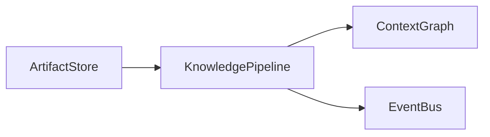

# Knowledge Pipeline Specification

**Document ID:** SPEC-0008

**Version:** 1.0

**Status:** Accepted

**Last Updated:** 2026-07-05

---

# Purpose

The Knowledge Pipeline transforms immutable artifacts into structured understanding.

It is the bridge between evidence and meaning.

The pipeline extracts, validates, enriches, and connects information before updating the Context Graph and emitting domain events.

The pipeline itself contains no product-specific business logic. It provides reusable knowledge-processing capabilities for the rest of Atlas.

---

# Philosophy

Artifacts preserve evidence.

The Knowledge Pipeline derives understanding.

Understanding is always explainable and ultimately traceable back to one or more artifacts.

Whenever deterministic processing can produce equivalent results, it is preferred over AI-assisted processing.

---

# Position in the Architecture



---

# Design Goals

The pipeline should be:

- Deterministic-first
- Replayable
- Incremental
- Explainable
- Idempotent
- Extensible
- Parallelizable
- Storage-independent

---

# Processing Model

Each artifact flows through a series of independent stages.

```text
Artifact

↓

Validation

↓

Normalization

↓

Classification

↓

Extraction

↓

Enrichment

↓

Entity Resolution

↓

Relationship Resolution

↓

Graph Update

↓

Event Publication
```

Each stage should have one responsibility.

Stages communicate through events rather than direct invocation.

---

# Pipeline Stages

## Validation

Validation confirms that an artifact can be processed.

Typical checks include:

- Integrity
- Checksum
- Encoding
- Format
- Supported media type
- Malware policy (future)

Validation produces factual outcomes only.

---

## Normalization

Normalization converts artifacts into canonical internal representations.

Examples:

- HTML → Markdown
- DOCX → Structured text
- Image metadata normalization
- Character encoding normalization

Normalization must never change meaning.

---

## Classification

Classification determines what the artifact represents.

Examples:

- Receipt
- Research paper
- Calendar event
- Resume
- Invoice
- Meeting notes

Classification should prefer deterministic rules before invoking machine learning.

---

## Extraction

Extraction identifies structured information.

Examples:

- People
- Organizations
- Dates
- Locations
- Monetary values
- URLs
- Tasks
- Deadlines
- Contact information

Extraction may combine deterministic parsers with AI when necessary.

---

## Enrichment

Enrichment derives additional context.

Examples:

- Language detection
- Geographic lookup
- Currency normalization
- Time zone resolution
- Document similarity
- Topic identification

Enrichment increases usefulness without altering the original artifact.

---

## Entity Resolution

Entity Resolution determines whether extracted entities refer to existing concepts.

Example:

```
"OpenAI"

↓

Existing Organization Node
```

rather than creating duplicates.

Resolution should be conservative.

False merges are more damaging than duplicate entities.

---

## Relationship Resolution

Relationships are inferred between resolved entities.

Examples:

```
Person

WORKS_ON

Project
```

```
Article

REFERENCES

Technology
```

Relationships require supporting evidence.

---

## Graph Update

Validated entities and relationships are incorporated into the Context Graph.

Graph updates must be:

- Atomic
- Replayable
- Explainable

No graph modification should occur without supporting evidence.

---

## Event Publication

Each completed stage publishes events describing what occurred.

Examples:

- ArtifactValidated
- ArtifactClassified
- EntitiesExtracted
- GraphUpdated

These events drive downstream Specialists.

---

# AI Participation

AI is a participant—not the pipeline.

Potential AI-assisted stages include:

- OCR
- Summarization
- Entity extraction
- Topic modeling
- Semantic similarity

Deterministic stages should not invoke AI unnecessarily.

---

# Replay

The pipeline must support complete replay.

Replay enables:

- Improved extraction algorithms
- Schema evolution
- New Specialists
- Context Graph reconstruction

Replay begins with immutable artifacts.

---

# Incremental Processing

Only affected stages should rerun when possible.

For example:

```
Improved Entity Resolver

↓

Replay Resolution Stage

↓

Graph Update

↓

Events
```

Earlier stages need not repeat if their outputs remain valid.

---

# Explainability

Every derived fact should answer:

- Which artifact produced this?
- Which pipeline stages contributed?
- Which algorithms were used?
- Was AI involved?
- What confidence was assigned?

---

# Error Handling

Pipeline failures should produce events rather than silent failures.

Examples:

- ArtifactValidationFailed
- OCRFailed
- EntityResolutionFailed
- GraphUpdateRejected

Errors become observable history.

---

# Extensibility

New stages may be introduced provided they:

- Have a single responsibility
- Preserve replayability
- Emit events
- Maintain explainability

Stages should remain loosely coupled.

---

# Non-Goals

The Knowledge Pipeline does **not**:

- Prioritize work
- Generate Executive Briefs
- Execute user actions
- Maintain long-term memory
- Render UI

Its responsibility ends when structured understanding has been produced.

---

# Related Documents

- SPEC-0003 Artifact Model
- SPEC-0004 Context Graph
- SPEC-0001 Event Model
- SPEC-0002 Event Catalog
- ADR-0003 Event-Driven Architecture

---

# Guiding Principle

> **Every conclusion in Atlas begins as evidence and passes through a transparent process of understanding.**

The Knowledge Pipeline ensures that this process remains explainable, deterministic where possible, and continuously improvable.
