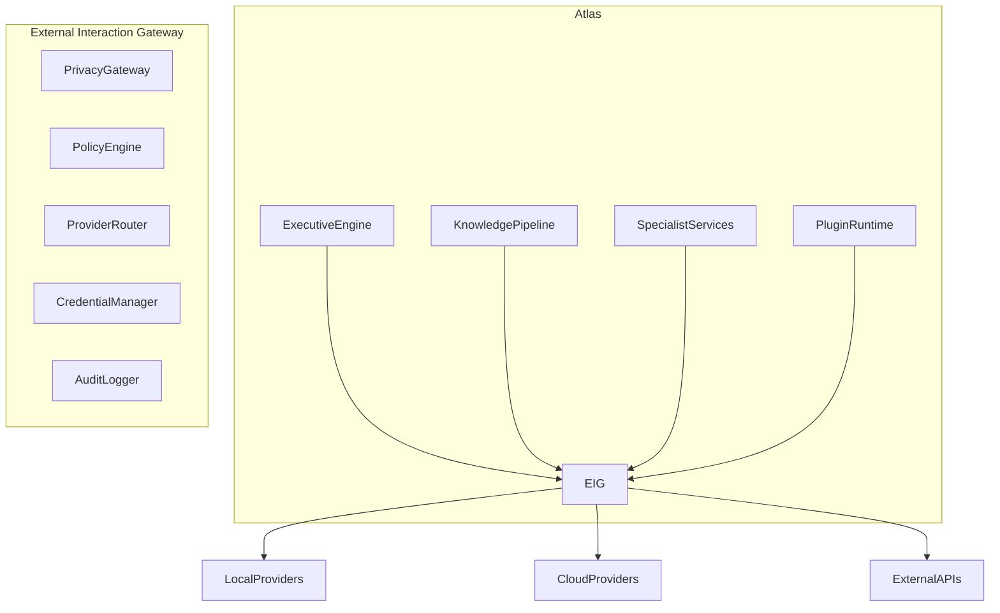

# External Interaction Gateway Specification

**Document ID:** SPEC-0010

**Version:** 1.0

**Status:** Accepted

**Last Updated:** 2026-07-05

---

# Purpose

The External Interaction Gateway (EIG) is the sole architectural boundary between Atlas and external systems.

Its purpose is to ensure that every interaction leaving or entering Atlas is:

- Explainable
- Policy-governed
- Privacy-aware
- Auditable
- User-controlled

No Atlas component may communicate directly with external providers.

All outbound and inbound communication must pass through the External Interaction Gateway.

---

# Philosophy

Atlas is local-first.

External services are capabilities, not dependencies.

The External Interaction Gateway ensures that Atlas remains functional without network connectivity while enabling secure and controlled access to external services when appropriate.

The user should never need to ask:

> "What data is leaving my device?"

Atlas should always be able to answer.

---

# Position in the Architecture



---

# Responsibilities

The External Interaction Gateway is responsible for:

- Privacy enforcement
- Policy evaluation
- Consent verification
- Provider routing
- Credential management
- Request transformation
- Response validation
- Audit logging
- Capability discovery

It is **not** responsible for:

- Knowledge extraction
- Business logic
- User interface
- Memory management
- Executive reasoning

---

# Core Principle

No external communication bypasses the gateway.

This includes:

- LLM providers
- OCR services
- Email APIs
- Calendar APIs
- Weather services
- Payment providers
- Plugin network access
- Synchronization services

---

# Architecture

```text
Atlas Component
        │
        ▼
External Interaction Gateway
        │
        ├── Privacy Gateway
        ├── Policy Engine
        ├── Consent Manager
        ├── Provider Router
        ├── Credential Manager
        ├── Request Transformer
        ├── Response Validator
        └── Audit Logger
        │
        ▼
External Service
```

---

# Privacy Gateway

The Privacy Gateway determines what information may leave Atlas.

Responsibilities include:

- Sensitivity detection
- Data minimization
- Redaction
- Abstraction
- Local-first evaluation

The Privacy Gateway is the policy core of the External Interaction Gateway.

---

# Policy Engine

The Policy Engine evaluates whether a request is permitted.

Policies may consider:

- Data sensitivity
- User preferences
- Network availability
- Provider trust level
- Regulatory requirements
- Plugin permissions

Every decision should be deterministic and explainable.

---

# Consent Manager

Certain requests require explicit user approval.

Examples include:

- Sending an email
- Uploading a passport
- Sharing financial records
- Connecting a new cloud provider

Consent decisions should be:

- Explicit
- Granular
- Revocable
- Auditable

---

# Provider Router

The Provider Router selects an appropriate provider based on:

- Required capability
- Privacy policy
- Cost
- Availability
- Latency
- User preference

Example:

```
Need:
Speech-to-text

↓

Local Whisper

↓

If unavailable

↓

Approved Cloud Provider
```

Routing decisions should be explainable.

---

# Credential Manager

Credentials are managed centrally.

Responsibilities include:

- Secure storage
- Rotation support
- Scoped access
- Least-privilege enforcement

Components never access provider credentials directly.

---

# Request Transformation

Before transmission, requests may be transformed.

Examples:

- Redacting names
- Removing identifiers
- Replacing account numbers
- Generalizing locations
- Compressing payloads

Transformations should preserve the minimum information necessary for the requested capability.

---

# Response Validation

Responses should be validated before entering Atlas.

Validation may include:

- Schema checks
- Provenance checks
- Safety policy evaluation
- Signature verification (where applicable)

Rejected responses should not affect the Context Graph.

---

# Audit Logging

Every external interaction generates an immutable audit record.

An audit entry includes:

- Timestamp
- Requesting component
- Provider
- Capability requested
- Policy decision
- Consent status
- Transformation summary
- Outcome

Sensitive content should not be stored in audit logs unless explicitly required.

---

# Local-First Resolution

The gateway should always attempt local execution first when equivalent capabilities are available.

Decision order:

```text
Local Provider
        ↓
Trusted Local Plugin
        ↓
Approved Cloud Provider
        ↓
Failure
```

Cloud execution should be the exception, not the default.

---

# Capability-Based Routing

Components request capabilities rather than providers.

Example:

Instead of:

```
Use OpenAI GPT-5
```

Components request:

```
Capability:
Summarization
```

The gateway determines the provider.

This decouples Atlas from individual vendors.

---

# Plugin Interaction

Plugins must declare:

- Required capabilities
- Network requirements
- Data categories accessed

The gateway evaluates plugin requests using the same policy framework as core services.

Plugins receive only the minimum permissions required.

---

# Explainability

Atlas should always be able to answer:

- Why was this provider chosen?
- Why was cloud execution required?
- What data was transmitted?
- What transformations occurred?
- What policy allowed this request?

---

# Failure Handling

If external communication fails, the gateway should:

- Retry where appropriate
- Select alternative providers
- Degrade gracefully
- Surface clear diagnostics

Failures should not compromise local functionality.

---

# Security

The gateway should support:

- TLS verification
- Certificate pinning (where appropriate)
- Request signing
- Response verification
- Rate limiting
- Replay protection

Specific mechanisms are implementation details.

---

# Offline Operation

Atlas must remain operational without network access.

When offline:

- Local providers remain available.
- Cloud requests are deferred or rejected based on policy.
- Executive products should explain reduced capability where relevant.

Offline mode is a first-class operating state.

---

# Future Capabilities

The gateway should accommodate future integrations without architectural changes, including:

- New AI providers
- Government services
- Financial institutions
- Enterprise systems
- IoT devices
- Federated Atlas instances

---

# Non-Goals

The External Interaction Gateway is not:

- An AI orchestration framework
- A workflow engine
- A synchronization engine
- A plugin runtime

Its role is governance and mediation.

---

# Related Documents

- ADR-0002 Local-First Architecture
- SPEC-0005 Attention Engine
- SPEC-0008 Knowledge Pipeline
- *(Future)* Privacy Gateway Specification
- *(Future)* Consent Model Specification
- *(Future)* Data Classification Specification

---

# Guiding Principle

> **Every interaction beyond Atlas's boundary must be intentional, explainable, and governed.**

The External Interaction Gateway protects the user's privacy and agency by ensuring that external capabilities are used only when appropriate, with the minimum necessary disclosure and complete transparency.
